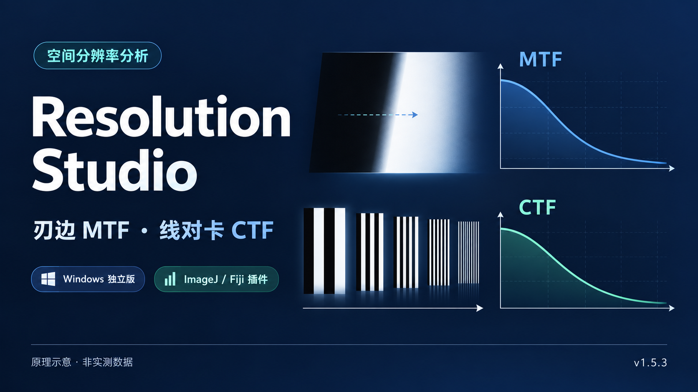
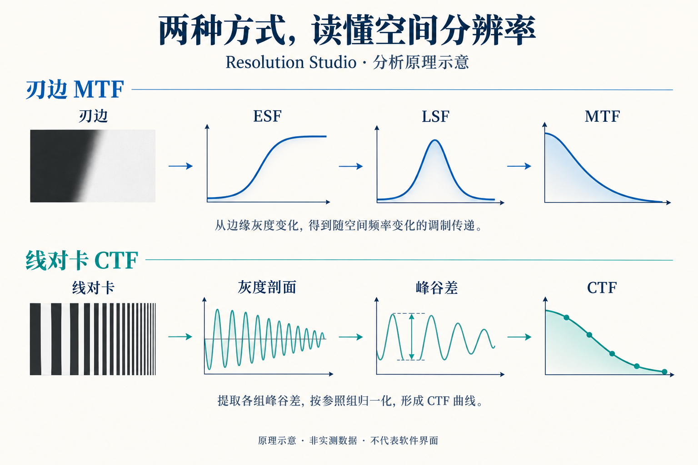
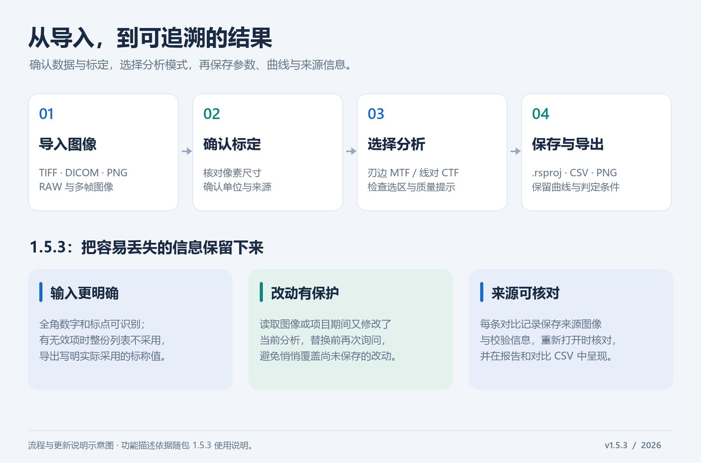

# Resolution Studio

用于图像空间分辨率分析的桌面工具，提供 **刃边 MTF** 与 **线对卡 CTF** 两种测量模式。支持独立运行，也可作为 ImageJ / Fiji 插件使用。

**[下载最新版本](https://github.com/Nanamiwww/resolution-studio/releases/latest)** · **[完整使用说明](使用说明.txt)** · **[问题反馈](https://github.com/Nanamiwww/resolution-studio/issues)**

## 下载与启动

在 [Releases](https://github.com/Nanamiwww/resolution-studio/releases) 的 **Assets** 中下载 `Resolution-Studio-1.5.3.zip`，完整解压后使用。

| 使用方式 | 操作 | 运行要求 |
| --- | --- | --- |
| Windows 独立版 | 双击 `启动 Resolution Studio.bat` | Java 8 或更新版本 |
| ImageJ / Fiji 插件 | 将 `插件版/Resolution_Studio.jar` 复制到 ImageJ / Fiji 的 `plugins` 文件夹，重启后选择 **Plugins → Resolution Studio** | 已安装 ImageJ 或 Fiji |

独立版已包含 ImageJ 1.54u 内核与界面库，不需要另装 ImageJ；**下载不包含 Java 运行时**。Windows 启动器会查找已安装或 ImageJ / Fiji 自带的 Java，找不到时会给出中文提示。

下载包没有预设机器专属的 `java-path.cfg`，首次启动后由启动器生成。完整包内还附有三张模拟示例图像、使用说明、源码包与第三方许可文件。

## 主要功能

从一张图像出发，完成像素标定、选区分析、曲线对比与结果导出。两种模式对应不同的测试图像，可按测量对象选择：

| 分析模式 | 输入与操作 | 主要输出 |
| --- | --- | --- |
| **刃边 MTF** | 在包含明暗边界的图像中选择矩形区域，检查刃边方向和质量提示 | ESF、LSF、MTF 曲线与 MTF20 / MTF10 |
| **线对卡 CTF** | 提取条纹灰度剖面，检查峰谷分组、标称频率及参照组 | 分组对比度、CTF 曲线与带条件说明的分辨率结果 |



*封面与上图为生成的原理示意，不是软件截图或实测结果。*

- **刃边 MTF**：矩形选区分析，显示 MTF、ESF、LSF、MTF20 / MTF10、刃边倾角及质量提示。
- **线对卡分析**：灰度剖面、峰谷分组、对比度与 CTF；支持手动分组、标称频率、参照组和分辨率判定。
- **标定与图像处理**：手动或按已知长度标定像素尺寸，显示标定来源；支持多帧图像及颜色 / 灰度处理选择。
- **导入与导出**：支持 TIFF、DICOM、PNG 等图像和 RAW 导入；导出 CSV 数据、PNG 图表及结果摘要。
- **项目与对比**：保存 `.rsproj` 项目，叠加历史曲线，并保留测量参数、来源和警告信息。

## 典型工作流程



1. **导入并核对图像**：确认帧、颜色处理方式及像素数值来源；RAW 文件需填写对应的格式参数。
2. **确认像素标定**：手动设置像素尺寸，或使用已知长度标定，并检查单位。
3. **选择分析模式**：刃边模式检查选区和质量提示；线对卡模式核对峰谷分组、标称频率和参照组。
4. **保留分析记录**：保存项目以便继续分析，或导出 CSV、PNG 图表与摘要用于整理结果。

## 1.5.3 更新重点

以下内容根据随包更新记录整理：

- 线对卡整卡标称值采用统一校验，支持全角数字和标点；任一项无效时整份列表不采用，并在保存、导出或关闭前提示。
- 尚未确认的标称值输入显示为蓝色，可按回车应用或按 Esc 撤销；导出明确记录实际采用的列表。
- 打开旧项目时，报告无效标称值或新旧解析结果的差异，便于识别结果变化的原因。
- 后台读取图像或项目期间若当前分析又被修改，替换前再次询问，保护像素尺寸、选区和输入等改动。
- 每条对比记录保存自己的来源图像信息、SHA-256、帧和颜色处理方式；打开项目时逐一核对，核对结果写入报告与对比 CSV。

详细变更与历史版本记录见[使用说明](使用说明.txt)。

## 测量说明

分析前请确认像素尺寸、测量方向和图像数值来源。线对卡结果可能以插值、估计、区间或下限形式给出，应结合程序显示的条件解释。CTF 及其换算结果与直接测得的刃边 MTF 需区分。

刃边模式默认不旋转图像；旋转计算为实验性选项。随包示例是模拟图像，用于熟悉操作。

## 源码与构建

完整包中的 `源码.zip` 包含程序源码、测试和构建脚本；也可从 Release 单独下载 `Resolution-Studio-1.5.3-source.zip`。

源码包的 `build.sh` 需要 **Bash、Git 和 JDK 11 或更新版本**，会联网取得指定提交的 ImageJ 与 FlatLaf 源码，并在生成 JAR 前运行回归测试。在具备这些工具的环境中，进入源码目录后运行：

```bash
bash build.sh
```

源码中的 `make_release.sh` 依赖开发工作区的目录布局，首次构建请使用 `build.sh`。本次发布沿用所提供的 1.5.3 JAR 文件。

## 第三方组件与校验

使用 ImageJ 和 FlatLaf；第三方许可文件保留在完整包的 `licenses/` 文件夹中，并在仓库提供副本。

发行页面提供 `SHA256SUMS.txt`，用于核对完整包和源码包的完整性。GitHub 自动生成的 `Source code` 归档是仓库内容快照，使用软件请下载上面指定的完整包。
